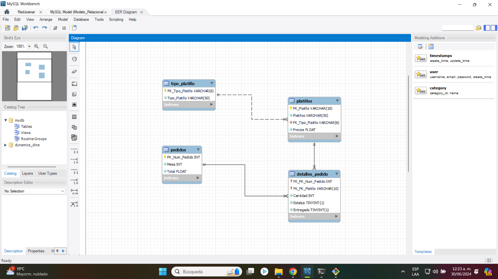
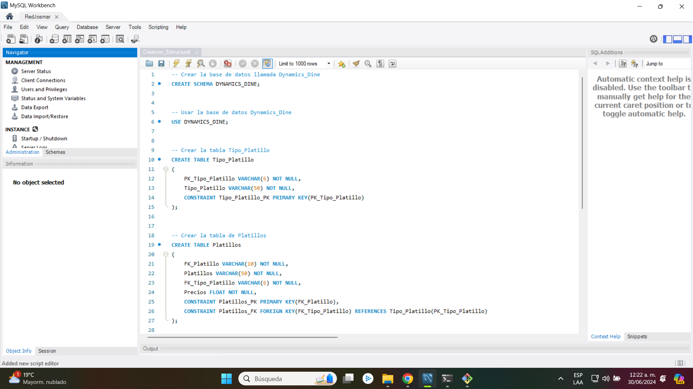
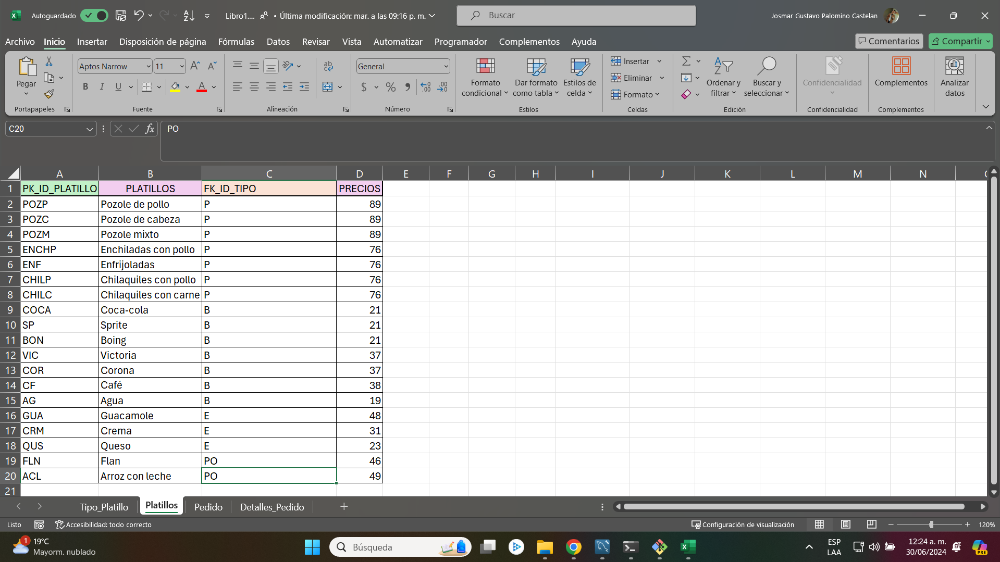
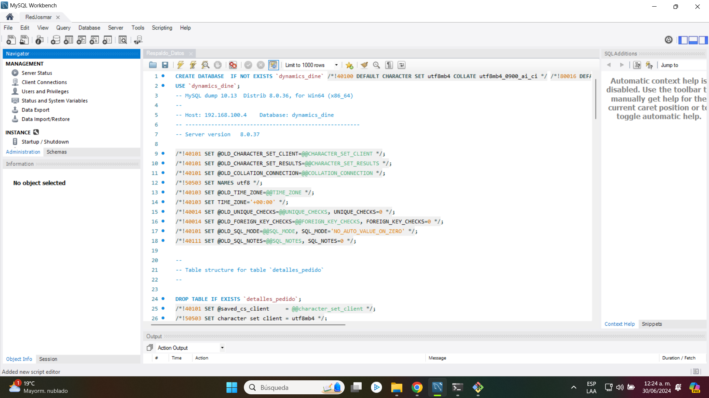
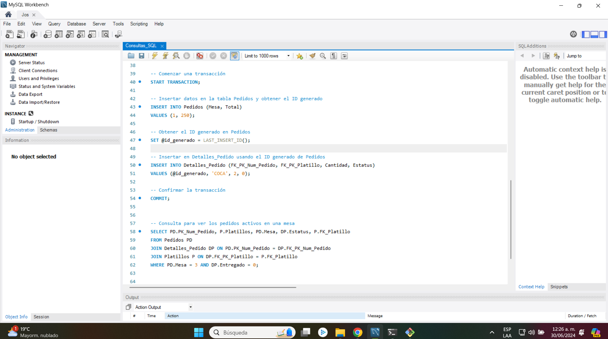

# Presentación

Este proyecto es un sistema de gestión de pedidos diseñado para el restaurante "La Casa De Toño". Este sistema incluye el diseño y desarrollo de la base de datos que respalda el funcionamiento tanto de la aplicación móvil como de la aplicación de escritorio. El objetivo principal es optimizar la gestión de pedidos, proporcionando una interfaz intuitiva y eficiente para los usuarios, así como una infraestructura sólida y confiable para el manejo de los datos.

<h1 align="center"> Diseño y desarrollo de la base de datos </h1>

 Modelo relacional 

# Tabla de contenidos:

---

- [Badges](#badges)
- [Capturas de pantalla](#capturas-de-pantalla)
- [Descripción del proyecto](#descripción-del-proyecto)
- [Herramientas utilizadas](#herramientas-utilizadas)
- [Guía de instalación](#guía-de-instalación)
- [Autores](#autores)
- [Información adicional](#información-adicional)

# Badges

---

- Estado del Proyecto: 
- Versión Actual: 
- Tipo de proyecto: 
- Categoría del proyecto: 
- Tipo de base de datos: 

# Capturas de pantalla

---

A continuación, se presentan capturas de pantalla que destacan puntos clave sobre el diseño y desarrollo de nuestra base de datos. Estas imágenes muestran el proceso completo, desde la creación estructural de la base de datos hasta las consultas realizadas para el uso de las aplicaciones.

## Captura de la creación estructural

## Captura del modelo relacional

## Captura de la carga bruta de datos

## Captura del respaldo de la base de datos

## Captura de las consultas SQL usadas en el desarrollo

# Descripción del proyecto

---

El presente repositorio representa un proyecto integral del diseño y desarrollo de la base de datos para la gestión de pedidos de alimentos en un restaurante llamado "La Casa De Toño". Esta sección del repositorio muestra y contiene la base de datos necesaria para el correcto funcionamiento del sistema de pedidos.

1. **Creación estructural de la base de datos:**

- Relación de tipo de platillos
- Relación de platillos
- Relación de pedidos
- Relación de detalles de pedido realizado

2. **Inserción de datos:**

- Se insertaron datos que maneja "La Casa De Toño" como los platillos que ellos tienen en us restaurante. Se pueden ingresar más y las aplicaciónes seguirian operando.

# Herramientas utilizadas

---

- [MySQL Workbench 8.0.34](https://dev.mysql.com/downloads/workbench/)
- [MySQL Connector 8.4.0](https://dev.mysql.com/downloads/connector/python/)
- [ColorCode](https://htmlcolorcodes.com/es/)
- [Shields.io](https://shields.io/badges/static-badge)

# Guía de instalación

---

Guía de Instalación
¡Bienvenido al repositorio del proyecto de gestión de pedidos "La Casa De Toño"! A continuación, encontrarás una guía paso a paso para descargar, configurar la base de datos y comenzar a trabajar con este proyecto en Python.

1. Descargar el Repositorio:

- Ve al repositorio en GitHub: [Repositorio de la base de datos de "La Casa De Toño"](https://github.com/Josmar360/Dynamics_Dine/tree/Base_De_Datos) 
- Haz clic en el botón verde "Code" y selecciona "Download ZIP".
- Descomprime el archivo ZIP en la ubicación de tu elección.

2. Configurar la Base de Datos:

- Ve al repositorio en GitHub: [Repositorio de la base de datos de "La Casa De Toño"](https://github.com/Josmar360/Dynamics_Dine/tree/Base_De_Datos)
- Sigue los pasos de configuración para la base de datos.

3. Importación de Datos del Respaldo:

- Abre MySQL Workbench y conéctate a tu servidor de base de datos.
- Crea una nueva base de datos o selecciona la base de datos existente para "La Casa De Toño".
- Ve a "Server" en el menú superior y selecciona "Data Import".
- Selecciona "Import from Self-Contained File" y busca el archivo de respaldo de la base de datos [Respaldo_Datos.sql](https://github.com/Josmar360/Dynamics_Dine/blob/Base_De_Datos/Consultas_SQL.sql) incluido en el repositorio.
- Asegúrate de seleccionar la base de datos correcta en "Default Target Schema".
- Haz clic en "Start Import" para importar los datos del respaldo.

# Autor/es

---

- [Josmar Gustavo Palomino Castelan](https://linktr.ee/josmar360)
- [Paola Espinoza Alvarez](https://github.com/Paoinoza)

# Información adicional

---

Este proyecto tiene como objetivo la automatización de pedidos para el restaurante conocido como "Casa Toño". A través de este proyecto, buscamos aplicar nuestras destrezas en el diseño y desarrollo de bases de datos y en la creación de una aplicación práctica utilizando Python y Pygame. Nuestra meta es no solo adquirir experiencia en la creación y gestión de bases de datos, sino también demostrar la utilidad y aplicabilidad de nuestros conocimientos en un escenario empresarial real. Con este proyecto, esperamos proporcionar una solución eficiente y funcional que mejore el proceso de pedidos en "Casa Toño".

- [Regresar al inicio](#presentación)
