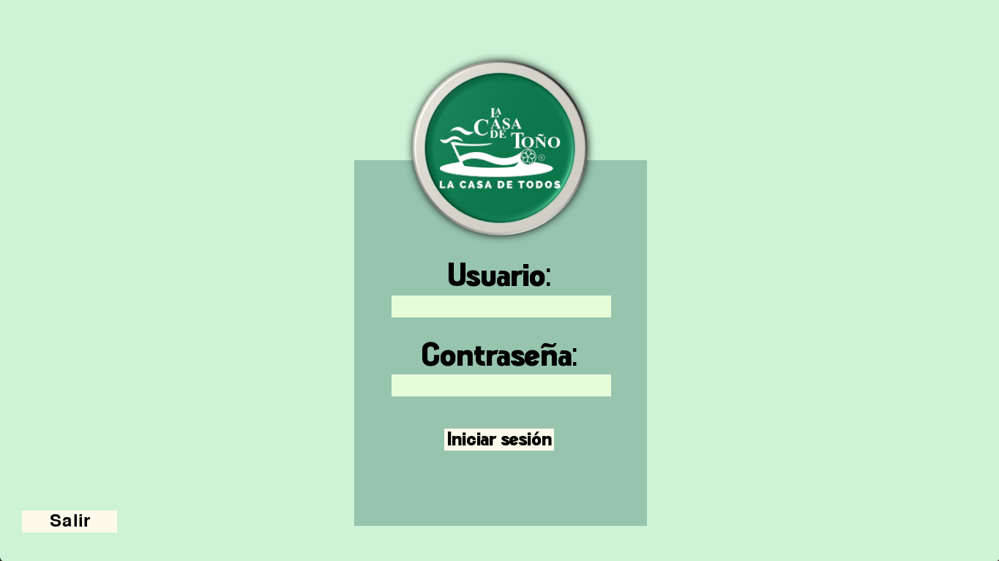

# Presentación

Este proyecto es un sistema de gestión de pedidos para un restaurante conocida como "Casa Toño", desarrollado utilizando Python, Pygame y MySQL. La aplicación permite a los usuarios iniciar sesión y acceder a una pantalla donde se muestran los pedidos activos en la cocina.

<h1 align="center"> Diseño de aplicación de escritorio para una cocina </h1>
<p align="center">Pantalla de pedidos activos </p>
<p align="center"></p>

# Tabla de contenidos:

---

- [Badges](#badges)
- [Capturas de pantalla](#capturas-de-pantalla)
- [Descripción del proyecto](#descripción-del-proyecto)
- [Herramientas utilizadas](#herramientas-utilizadas)
- [Guía de instalación](#guía-de-instalación)
- [Autores](#autores)
- [Información adicional](#información-adicional)

# Badges

---

- Estado del Proyecto: 
- Versión Actual: 
- Uso de dependencias: 
- Tipo de proyecto: 
- Categoría del proyecto: 
- Tipo de base de datos: 

# Capturas de pantalla

---

Las capturas de pantalla a continuación destacan puntos clave sobre el sistema de gestión de pedidos, se muestra como es el inicio de sesión y la pantalla activa de los pedidos solicitados.

## Captura de pantalla de inicio de sesión



## Captura de pantalla de pedidos activos


# Descripción del proyecto

---

El presente repositorio representa un proyecto integral de diseño y desarrollo de un sistema de gestión de pedidos para los cocineros de un restaurante con el nombre "Casa Toño", a continuación se muestran algunos puntos clave:

1. **Pantalla de inicio de sesión:**

- Ingresar el nombre de usuario y la contraseña.
- Presionar `Enter` para cambiar entre los campos de entrada.
- Presionar el botón `Iniciar sesión` para intentar iniciar sesión.
- Presionar el botón `Salir` para cerrar la aplicación.

2. **Pantalla de pedidos activos:**

- Una vez que el usuario ha iniciado sesión, se mostrará una pantalla con la lista de pedidos activos en la cocina.
- Los pedidos se muestran en tiempo real, permitiendo al personal de cocina ver los pedidos pendientes y su estado.

# Herramientas utilizadas

---

- [MySQL Workbench 8.0.34](https://dev.mysql.com/downloads/workbench/)
- [MySQL Connector 8.4.0](https://dev.mysql.com/downloads/connector/python/)
- [Python 3.12.4](https://www.python.org/downloads/)
- [PyGame 2.6.0](https://www.pygame.org/news)
- [DateTime 5.5](https://pypi.org/project/DateTime/)
- [ColorCode](https://htmlcolorcodes.com/es/)
- [Shields.io](https://shields.io/badges/static-badge)

# Guía de instalación

---

¡Bienvenido al repositorio del proyecto de gestión de pedidos "Dynamics Dine"! A continuación, encontrarás una guía paso a paso para descargar, configurar la base de datos y comenzar a trabajar con este proyecto en Python.

1. **Descargar el Repositorio:**

   - Ve al repositorio en GitHub: https://github.com/Josmar360/Dynamics_Dine/tree/Aplicacion_Escritorio
   - Haz clic en el botón verde "Code" y selecciona "Download ZIP".
   - Descomprime el archivo ZIP en la ubicación de tu elección.

2. **Configurar la Base de Datos:**

   - Ve al repositorio en GitHub:https://github.com/Josmar360/Dynamics_Dine/tree/Base_De_Datos
   - Sigue los pasos de configuración para la base de datos.

3. **Iniciar el Proyecto en NetBeans:**
   - Asegúrate de tener Python 3.12.4 instalado en tu máquina. Puedes descargarlo desde el sitio oficial: [Descargar Python](https://www.python.org/downloads/).
   - Instala las dependencias necesarias:
     ```sh
     pip install pygame mysql-connector-python
     ```

## Ejecución de la Aplicación

1. Navega al directorio del proyecto:

   ```sh
   cd Dynamics_Dine
   ```

2. Ejecuta el archivo principal del proyecto:
   ```sh
   python Inicio.py
   ```

# Autor/es

---

- [Josmar Gustavo Palomino Castelan](https://linktr.ee/josmar360)
- [Paola Espinoza Alvarez](https://github.com/Paoinoza)

# Información adicional

---

Este proyecto tiene como objetivo la automatización de pedidos para el restaurante conocido como "Casa Toño". A través de este proyecto, buscamos aplicar nuestras destrezas en el diseño y desarrollo de bases de datos y en la creación de una aplicación práctica utilizando Python y Pygame. Nuestra meta es no solo adquirir experiencia en la creación y gestión de bases de datos, sino también demostrar la utilidad y aplicabilidad de nuestros conocimientos en un escenario empresarial real. Con este proyecto, esperamos proporcionar una solución eficiente y funcional que mejore el proceso de pedidos en "Casa Toño".

- [Regresar al inicio](#presentación)
