# Presentación

Este proyecto es un sistema para realizar pedidos de alimentos para un restaurante conocido como "La Casa De Toño". La aplicación está desarrollada utilizando Python, Kivy, Pillow y MySQL.

El sistema permite a los usuarios ver el menú de alimentos que ofrece el restaurante, incluyendo imágenes y descripciones de cada platillo. Los usuarios pueden seleccionar y agregar productos a su carrito de compras, especificando las cantidades deseadas. Una vez completado el pedido, este se envía a la cocina para su preparación. Además, la aplicación permite a los usuarios monitorear el estatus de cada producto solicitado, desde que es ordenado hasta que está listo para ser servido.

Las tecnologías utilizadas en este proyecto incluyen Python como lenguaje de programación principal, Kivy para el desarrollo de aplicaciones multitáctiles, Pillow para el procesamiento de imágenes, y MySQL como sistema de gestión de bases de datos relacional para almacenar y gestionar la información de los pedidos y productos.

<h1 align="center"> Diseño de aplicación móvil para pedidos de alimentos </h1>
<p align="center"> Pantalla de menú de alimentos </p>
<p align="center">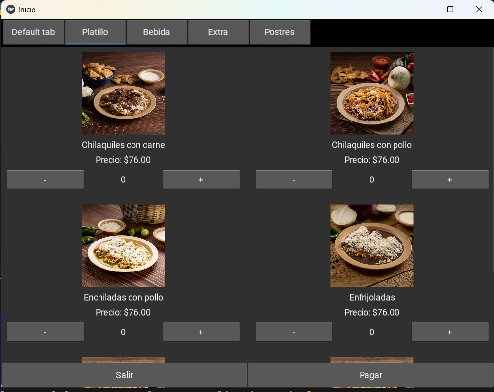</p>

# Tabla de contenidos:

---

- [Badges](#badges)
- [Capturas de pantalla](#capturas-de-pantalla)
- [Descripción del proyecto](#descripción-del-proyecto)
- [Herramientas utilizadas](#herramientas-utilizadas)
- [Guía de instalación](#guía-de-instalación)
- [Autores](#autores)
- [Información adicional](#información-adicional)

# Badges

---

- Estado del Proyecto: 
- Versión Actual: 
- Uso de dependencias: 
- Tipo de proyecto: 
- Categoría del proyecto: 
- Tipo de base de datos: 

# Capturas de pantalla

---

Las capturas de pantalla a continuación destacan puntos clave sobre el sistema de gestión de pedidos de "La Casa De Toño". Se muestra el flujo completo de la aplicación, desde la visualización del menú de alimentos hasta el monitoreo del estatus de cada producto solicitado. Este recorrido incluye la selección de productos, la adición de estos al carrito de compras, la confirmación del pedido, y finalmente, el seguimiento del estado de preparación de cada platillo.

## Captura de la selección de mesa

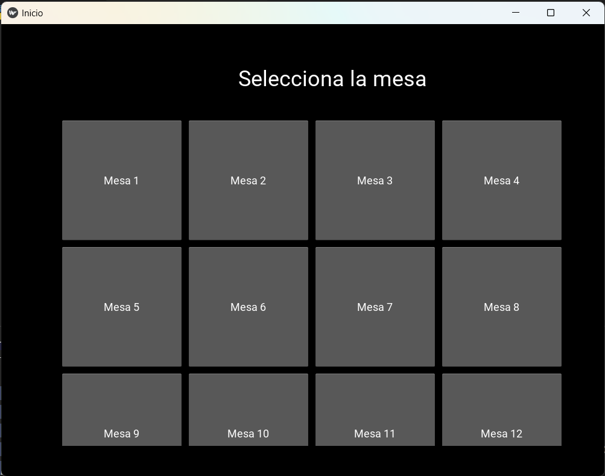

## Captura de pantalla de bienvenida

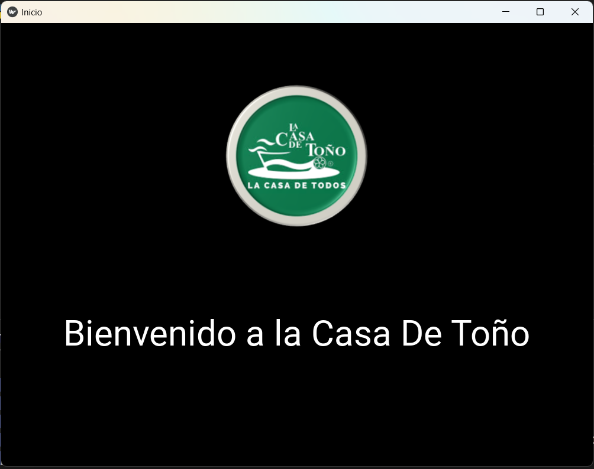

## Captura de pantalla del menú de alimentos


## Captura de pantalla del menú de bebidas

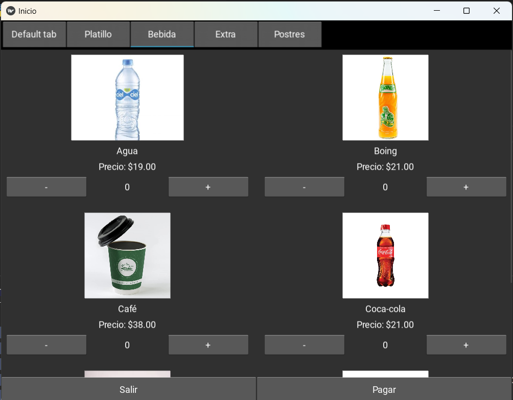

## Captura de pantalla del menú de extras

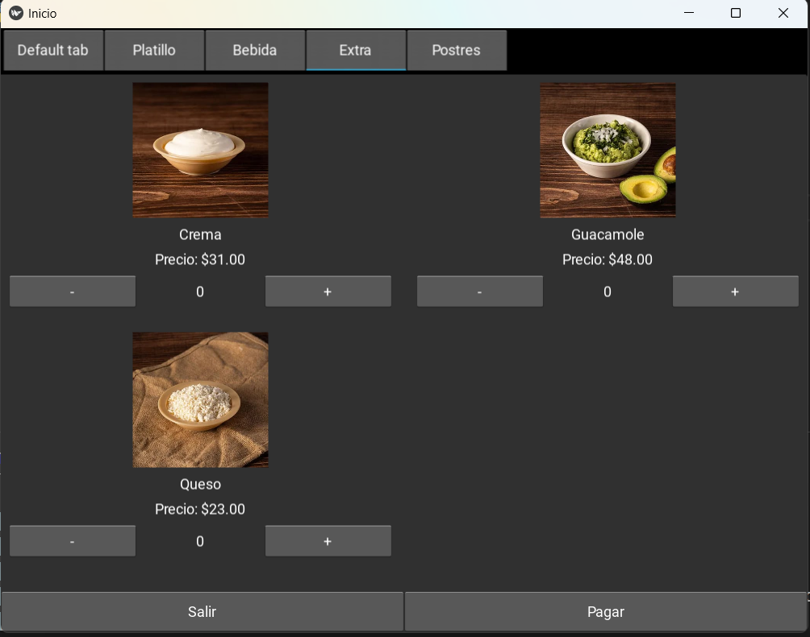

## Captura de pantalla del menú de postres

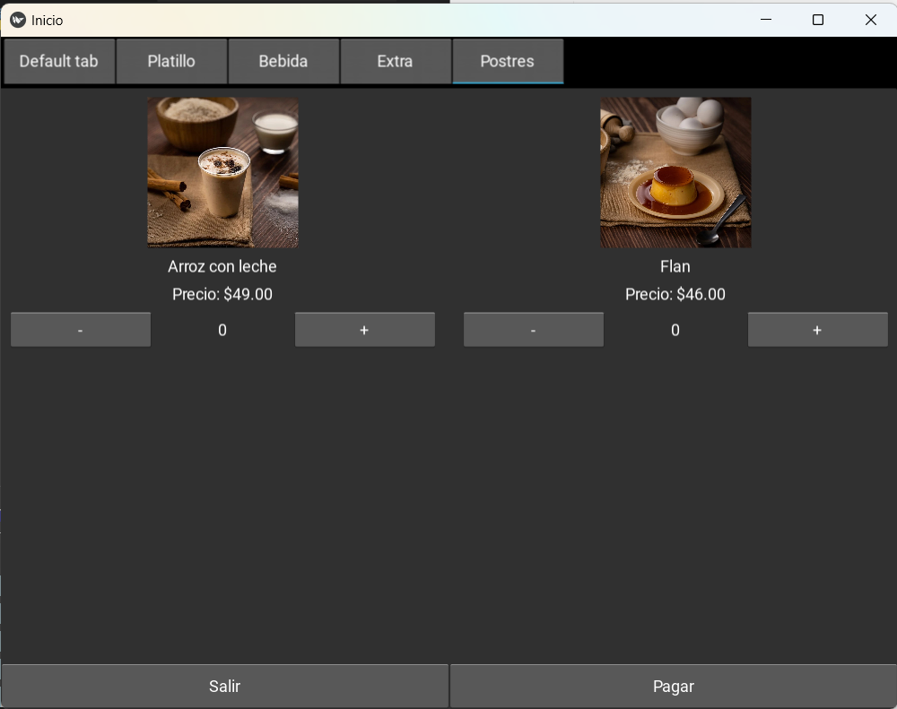

## Captura de pantalla del carrito de compras

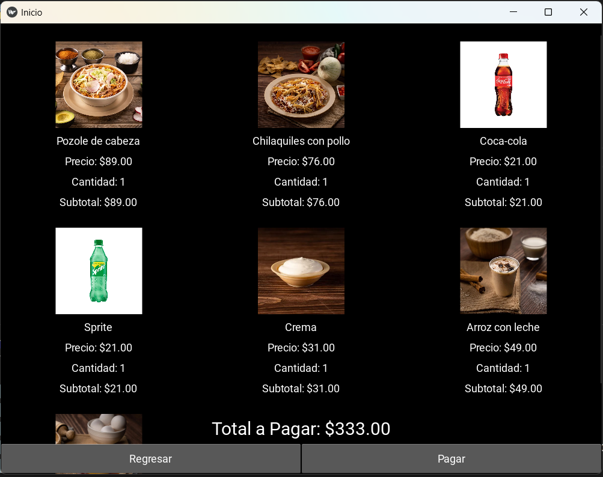

## Captura de pantalla del método de pago

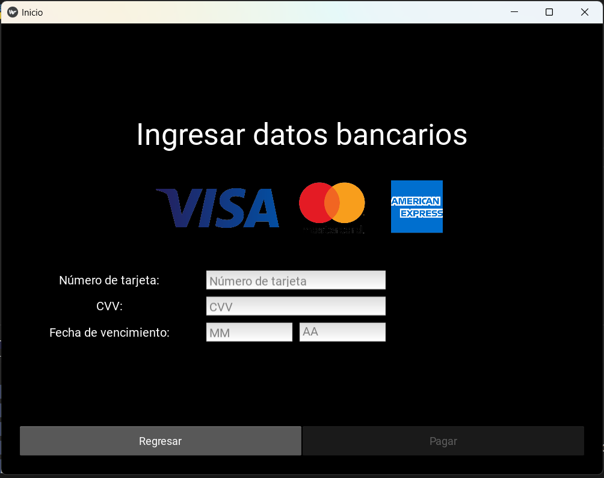

## Captura de pantalla de la confirmación del pedido

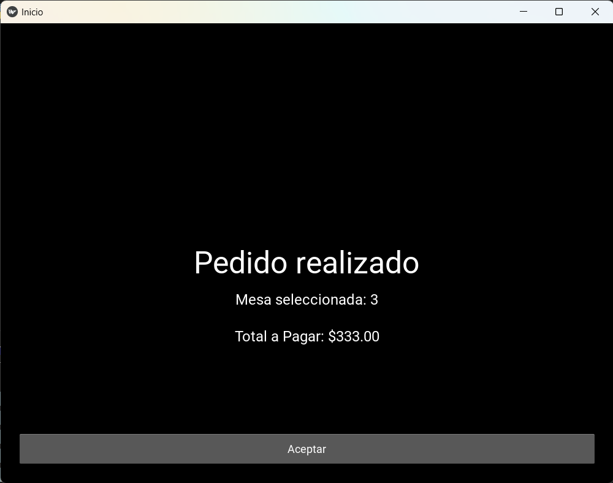

## Captura de pantalla del estatus pendiente

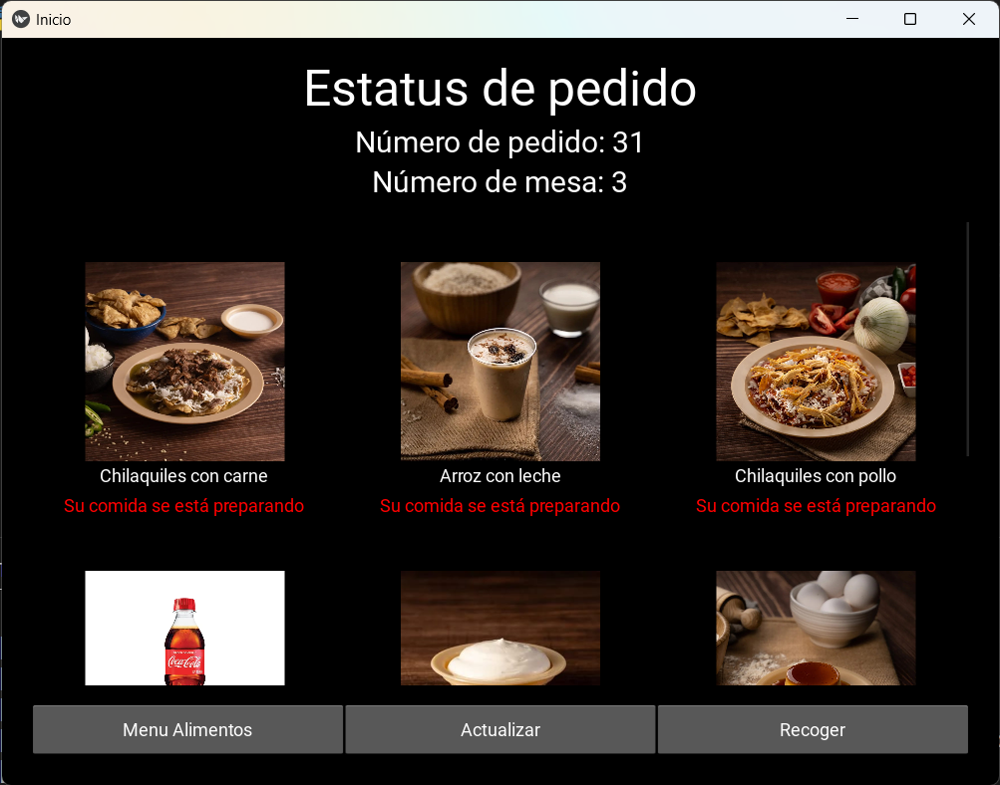

## Captura de pantalla del estatus terminado

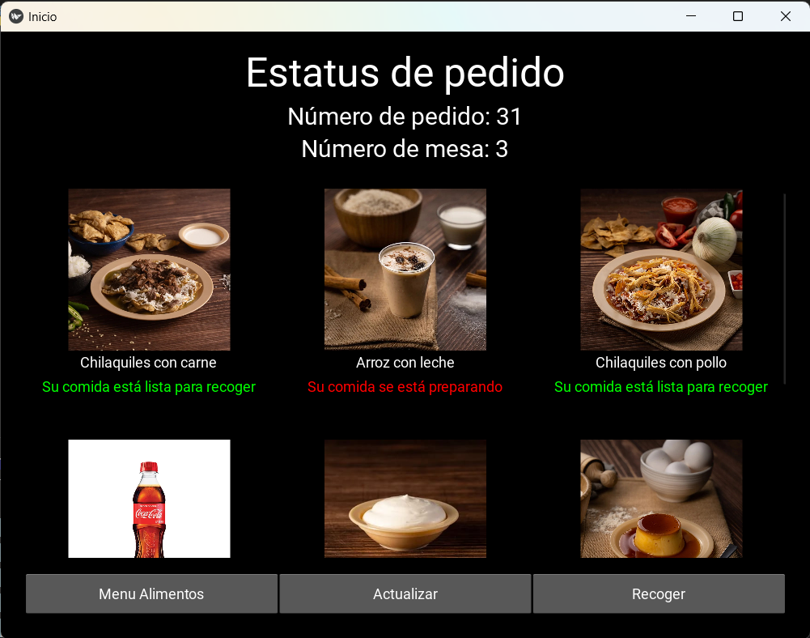

## Captura de pantalla del pedido recogido

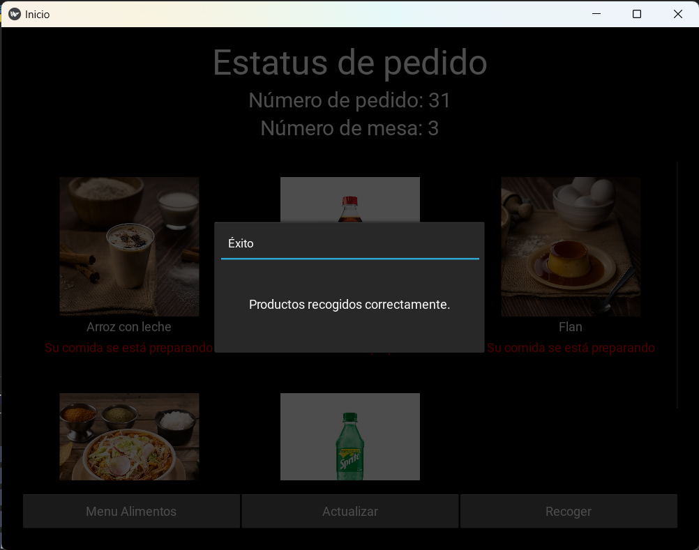

# Descripción del proyecto

---

El presente repositorio representa un proyecto integral de diseño y desarrollo de un sistema de gestión de pedidos para los cocineros de un restaurante con el nombre "La Casa De Toño". A continuación, se muestran algunos puntos clave sobre el flujo de la aplicación y su funcionamiento:

1. **Pantalla de Selección de Mesa:**

   - Al iniciar la aplicación, se pedirá al usuario que seleccione un número de mesa.
   - Una vez seleccionada la mesa, el usuario será dirigido a la pantalla de bienvenida.

2. **Pantalla de Bienvenida:**

   - En la pantalla de bienvenida, el usuario puede hacer clic o doble clic para ir al menú de alimentos.

3. **Menú de Alimentos:**

   - El menú de alimentos está organizado en las siguientes categorías: Alimentos, Bebidas, Extras y Postres.
   - Cada categoría muestra tarjetas de los productos con su imagen, nombre, precio, y botones para agregar o quitar productos.
   - En la parte inferior de la pantalla hay dos botones:
     - **Regresar**: Permite volver a la pantalla de bienvenida.
     - **Pagar**: Permite avanzar a la pantalla del carrito de compras.

4. **Carrito de Compras:**

   - Esta pantalla muestra los productos seleccionados con sus imágenes, nombres, precios y cantidades.
   - También se muestra el total de la compra.
   - Botones disponibles:
     - **Menú Alimentos**: Permite regresar al menú de alimentos.
     - **Pagar**: Permite avanzar a la pantalla de forma de pago.

5. **Forma de Pago:**

   - En esta pantalla, se solicita al usuario que ingrese los detalles de su tarjeta: número de tarjeta (16 dígitos), CVV (3 dígitos), y fecha de vencimiento (2 dígitos para mes y 2 dígitos para año).
   - Botones disponibles:
     - **Regresar**: Permite volver al carrito de compras.
     - **Pagar**: Inicialmente inhabilitado hasta que se ingresen todos los datos de la tarjeta de manera correcta. Una vez habilitado, permite avanzar a la pantalla de confirmación del pedido.

6. **Realizar Pedido:**

   - En esta pantalla, se muestra el pedido y el total pagado.
   - Botón disponible:
     - **Aceptar**: Al hacer clic, se avanza a la pantalla de estatus del pedido.

7. **Estatus del Pedido:**

   - Se muestran todos los productos comprados con su imagen, nombre y estatus.
   - Estatus disponibles:
     - **En preparación** (color rojo)
     - **Listo para recoger** (color verde)
   - Botones disponibles:
     - **Menú Alimentos**: Permite regresar al menú de alimentos.
     - **Actualizar**: Permite actualizar la pantalla para ver si ha cambiado el estatus de algún producto.
     - **Recoger**: Permite recoger los productos que ya están listos. Los productos listos desaparecerán de la pantalla, mientras que los que están en preparación se mantendrán.

Esta guía proporciona una visión general del flujo de la aplicación y cómo interactuar con cada pantalla para gestionar los pedidos en "La Casa De Toño".

# Herramientas utilizadas

---

- [MySQL Workbench 8.0.34](https://dev.mysql.com/downloads/workbench/)
- [MySQL Connector 8.4.0](https://dev.mysql.com/downloads/connector/python/)
- [Python 3.12.4](https://www.python.org/downloads/)
- [PyGame 2.6.0](https://www.pygame.org/news)
- [Pyllow 10.3.0](https://pypi.org/project/pillow/)
- [Kivy 2.3.0](https://kivy.org/doc/stable/gettingstarted/installation.html)
- [DateTime 5.5](https://pypi.org/project/DateTime/)
- [ColorCode](https://htmlcolorcodes.com/es/)
- [Shields.io](https://shields.io/badges/static-badge)

# Guía de Instalación

---

¡Bienvenido al repositorio del proyecto de gestión de pedidos "Dynamics Dine"! A continuación, encontrarás una guía paso a paso para descargar, configurar la base de datos y comenzar a trabajar con este proyecto en Python.

1. **Descargar el Repositorio:**

   - Ve al repositorio en GitHub: [Dynamics Dine Movil](https://github.com/Josmar360/Dynamics_Dine/tree/Aplicacion_Movil)
   - Haz clic en el botón verde "Code" y selecciona "Download ZIP".
   - Descomprime el archivo ZIP en la ubicación de tu elección.

2. **Configurar la Base de Datos:**

   - Ve al repositorio en GitHub: [Base de Datos](https://github.com/Josmar360/Dynamics_Dine/tree/Base_De_Datos)
   - Sigue los pasos de configuración para la base de datos.

3. **Instalar Dependencias:**

   - Asegúrate de tener Python 3.12 instalado en tu máquina. Puedes descargarlo desde el sitio oficial: [Descargar Python](https://www.python.org/downloads/).
   - Instala las dependencias necesarias:

     ```sh
     pip install kivy
     pip install pillow
     pip install mysql-connector-python
     ```

     ```sh
     pip install pillow
     ```

     ```sh
     pip install mysql-connector-python
     ```

4. **Ejecutar la Aplicación:**

   - Para ejecutar la aplicación desde el código fuente, navega al directorio donde descomprimiste el proyecto y ejecuta `Inicio.py`:
     ```sh
     python Inicio.py
     ```
   - Alternativamente, puedes utilizar el ejecutable disponible. Ve a la carpeta `dist` y luego a la subcarpeta `Dynamics_Dine`. Allí encontrarás el ejecutable `Dynamics_Dine_Movil.exe`:
     ```sh
     ./dist/Dynamics_Dine/Dynamics_Dine_Movil.exe
     ```

# Autor/es

---

- [Josmar Gustavo Palomino Castelan](https://linktr.ee/josmar360)
- [Paola Espinoza Alvarez](https://github.com/Paoinoza)

# Información adicional

---

Este proyecto tiene como objetivo la automatización de pedidos para el restaurante conocido como "La Casa De Toño". A través de este proyecto, buscamos aplicar nuestras destrezas en el diseño y desarrollo de bases de datos y en la creación de una aplicación práctica utilizando Python y Pygame para el desarrollo de una interfaz de escritorio, y para una interfaz tactil usaremos Kivy y Pillow. Nuestra meta es no solo adquirir experiencia en la creación y gestión de bases de datos, sino también demostrar la utilidad y aplicabilidad de nuestros conocimientos en un escenario empresarial real. Con este proyecto, esperamos proporcionar una solución eficiente y funcional que mejore el proceso de pedidos en "Casa Toño".

- [Regresar al inicio](#presentación)
